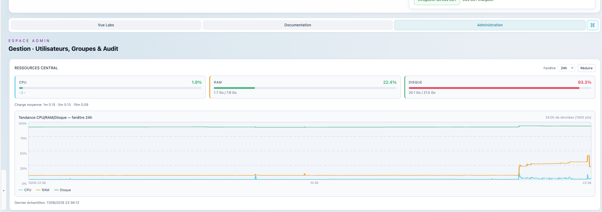
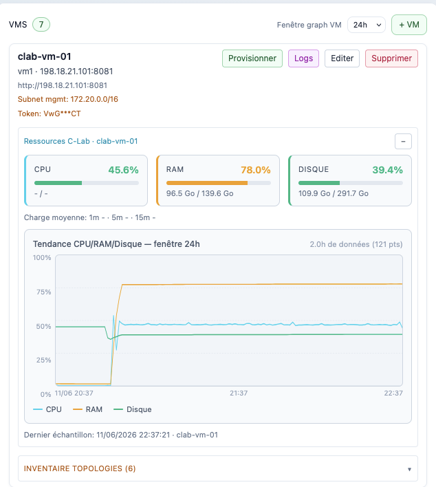
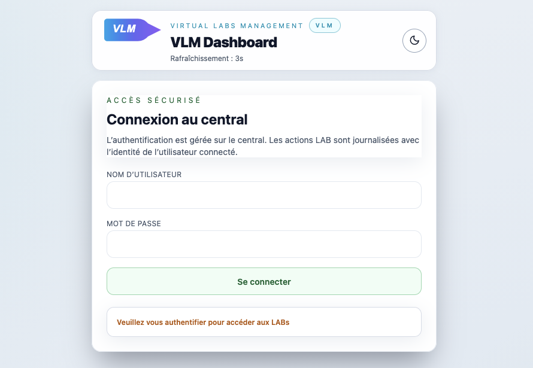
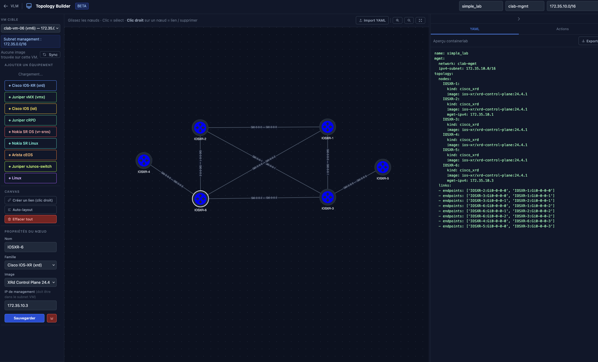
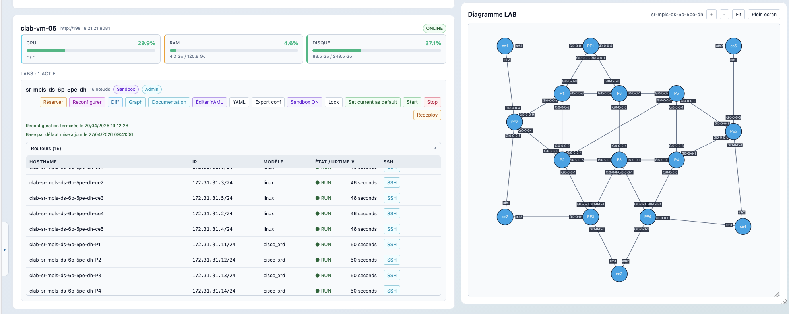
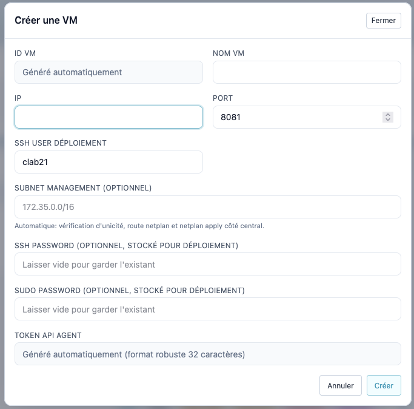
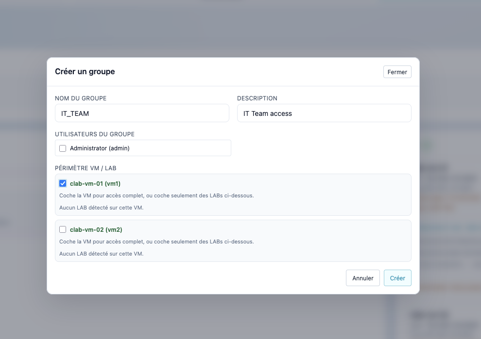
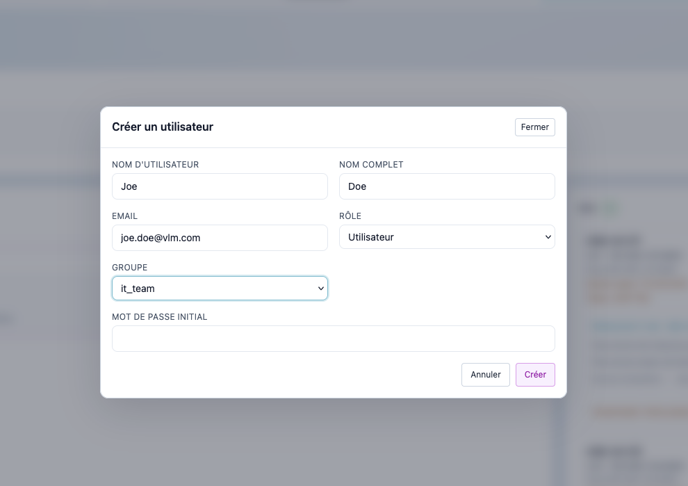
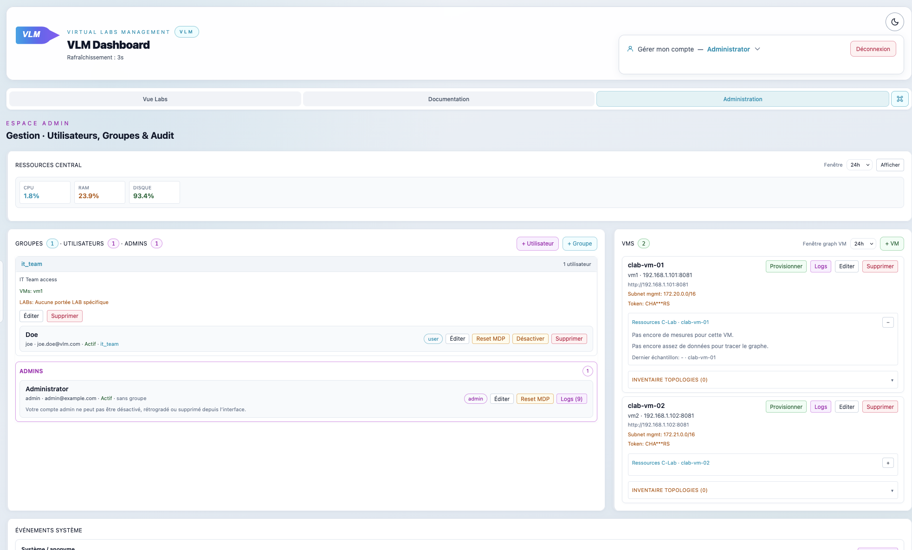

# VLM — Virtual Labs Management

A self-hosted web platform for managing virtual network labs powered by [containerlab](https://containerlab.dev), deployed on physical VMs.

## Overview

VLM provides a central dashboard to create, start, stop, reconfigure, and share network topology labs across a fleet of container lab VMs. It supports multi-user access with role-based permissions, lab reservations, sandbox mode, and real-time resource monitoring.

### Key Features
- Multi-VM fleet management from a single dashboard
- Lab lifecycle: start / stop / redeploy / reconfigure / set-default-config
  * Default Configuration : A base-default configuration set by the Administrators, at the end of each reservation cycle, all nodes are reconfigured to default.
  * Reconfigure : Manually reset all nodes to base configuration.
- Lab reservations (time-limited, configurable max duration)
  * Access to nodes is only allowed for users that reserved the Lab. Rules are implemented on the Central to restrict access.
  * Users should use the VLM Central using their username/password to login (SSH) and access to nodes (IP or Hostname)
- Sandbox mode (capacity checks, trace visualization)
  * A lab that can be edited by users : Topology change, at the end of the reservation Lab is reset to original Topology and configuration.
- Role-based access: admin / group-admin / user
  * Local users are created on the VLM Central Linux, so they can use the VLM Central as a Bastion to access to nodes.
  * SSH key can be added directly from the GUI Interface.
- SSH key management : Easy way to connect to the VLM Central without typing password.
- Audit logs (per-user, per-VM, system-wide)
- Real-time CPU/RAM/disk metrics with historical graphs
- Visual topology editor (Cytoscape.js based)
- Documentation panel (rich text + PDF per lab)
- Lab request workflow (user requests → admin approval)
- Dark/light theme

## Architecture

```
┌─────────────────────────────────────┐
│           VLM Central               │
│  FastAPI · Python 3.12 · Port 80    │
│  SQLite (WAL) · SPA Frontend (JS)   │
└────────────┬────────────────────────┘
             │ HTTP (Bearer token)
    ┌────────┼────────┐
    │        │        │
┌───┴──┐ ┌──┴───┐ ┌──┴───┐
│ VM 1 │ │ VM 2 │ │ VM N │   ← VM Agents
│:8081 │ │:8081 │ │:8081 │     FastAPI · Python 3.12
└──────┘ └──────┘ └──────┘
```

- **Central**: orchestrates the UI, user management, aggregated state, metrics collection
- **VM Agent**: thin wrapper around containerlab CLI, exposes REST API

## VM Resource Monitoring

VLM continuously collects CPU, RAM, and disk metrics from every VM agent in the fleet. Data is polled at each refresh cycle and stored in a local SQLite database with configurable retention (default: 24 h history, configurable up to several days).


### What is monitored

| Metric | Description |
|--------|-------------|
| CPU % | Aggregate CPU usage of the VM host |
| RAM used / total | Physical memory usage in MB |
| Disk used / total / % | Filesystem usage for the containerlab working directory |

The Central server also tracks its own CPU/RAM/disk usage through the same pipeline.
- Local Central Ressources Monitoring :


### Viewing metrics

In the **Admin Panel → VMs** tab, each VM card displays:
- Current CPU %, RAM %, disk % as live badges
- A historical graph (line chart) for each metric, selectable time window (1 h, 6 h, 24 h, …)
- Aggregated buckets for longer windows to keep the chart readable

- Remote Lab ressources management and lab inventory :


Metrics are fetched via:
- `GET /api/metrics/vm/{vm_id}?hours=24` — raw samples for a single VM
- `GET /api/metrics/vm/{vm_id}/aggregated?hours=24&bucket=5m` — bucketed history
- `GET /api/metrics/central` — Central server own metrics

## Prerequisites

- Python 3.12+
- [containerlab](https://containerlab.dev/install/) installed on each agent VM
- Linux (Ubuntu 22.04+ recommended)
- A management network between Central and VMs

## Quick Start

### 1. Clone the repository

```bash
git clone https://github.com/your-username/vlm.git
cd vlm
```

### 2. Configure Central

```bash
cp central/config.yaml.example central/config.yaml
# Edit central/config.yaml: add your VM agents IPs and tokens
```

See [Configuration](#configuration) for details.

### 3. Install and start Central

```bash
cd central
python3 -m venv .venv
source .venv/bin/activate
pip install -r requirements.txt

# Create initial admin user
python3 -c "
from src.services.auth import AuthService
svc = AuthService('data/users.json')
svc.create_user('admin', 'change-me-password', 'Administrator', role='admin')
"

# Start
uvicorn src.app:app --host 0.0.0.0 --port 8080
```


### 4. Install and start a VM Agent

On each VM that will run containerlab:

```bash
cd vm-agent
python3 -m venv .venv
source .venv/bin/activate
pip install -r requirements.txt

# Generate a random token (will be needed in central/config.yaml)
python3 -c "import secrets; print(secrets.token_urlsafe(24))"

# Start
uvicorn src.app:app --host 0.0.0.0 --port 8081
```

## Configuration

### `central/config.yaml`

```yaml
central:
  refresh_seconds: 3          # UI polling interval

auth:
  session_secret: CHANGE_ME   # Random string, min 32 chars
  users_file: data/users.json
  audit_file: data/audit.log.jsonl

agents:
  - id: vm1                   # Unique identifier
    name: clab-vm-01          # Display name
    ip: 192.168.1.101
    port: 8081
    token: RANDOM_TOKEN       # Must match vm-agent startup token
    base_url: http://192.168.1.101:8081
    management_subnet: 172.20.0.0/16   # Subnet used by containerlab on this VM
    ssh_user: clab-user       # SSH user for jump access feature
```

### `vm-agent/config.yaml`

```yaml
agent:
  bearer_token: RANDOM_TOKEN  # Must match central/config.yaml agents[].token
  log_level: INFO
```

## Topology Builder

VLM includes a visual topology editor for designing and deploying containerlab topologies directly from the browser.

### What it does

- **Drag-and-drop canvas** (Cytoscape.js) to place router nodes and draw links between interfaces
- **Router families** with automatic interface naming: Arista cEOS, Nokia SR Linux, Cisco IOS-XR, FRRouting, Linux, and more
- **Live validation** — checks node names, link consistency, management subnet conflicts before generating YAML
- **YAML generation** — produces a ready-to-deploy `.clab.yml` file
- **One-click sandbox deploy** — pushes the topology to a target VM and starts the lab immediately

### How to use it

1. Click the **Topology Builder** button in the lab dashboard
2. Select a target VM from the dropdown
3. Add nodes by clicking router families in the palette
4. Draw links by dragging between node ports
5. Set the lab name and management network
6. Click **Validate** to check the topology
7. Click **Deploy as Sandbox** to start it immediately, or **Download YAML** to save the `.clab.yml` file

### Sandbox Capacity Check

Before deploying a topology as a sandbox, VLM automatically checks whether the target VM has enough free resources to host all the requested router nodes.

Each router family has a known resource profile:

| Router kind | RAM estimate | CPU units |
|-------------|-------------|-----------|
| Arista cEOS | 1 500 MB | 95 |
| Nokia SR Linux | 1 400 MB | 90 |
| Cisco IOS-XR (XRd) | 2 200 MB | 130 |
| FRRouting | 300 MB | 20 |
| Linux container | 256 MB | 15 |

VLM sums the estimates for all nodes in the topology, then compares against the VM's current free memory and CPU. If the VM does not have sufficient headroom, the deployment is **blocked** with an explicit error message showing how much is needed vs. available. This prevents OOM-kills and degraded lab performance before they happen.

The same check runs when you **modify** an existing sandbox lab (e.g., adding nodes via the Topology Builder).



### Supported router families

| Family | Interface naming | Notes |
|--------|-----------------|-------|
| Arista cEOS | `eth1`, `eth2`, … | Popular software router |
| Nokia SR Linux | `e1-1`, `e1-2`, … | gNMI/gRPC native |
| Cisco IOS-XR | `GigabitEthernet0/0/0/0`, … | |
| FRRouting | `eth1`, `eth2`, … | Open-source, lightweight |
| Linux | `eth1`, `eth2`, … | Generic Linux container |

## Adding a Lab

A "lab" in VLM is a containerlab topology file. VLM auto-discovers labs by scanning the VM agent's filesystem — no manual registration needed.


### Rules for lab detection

#### 1. File naming

The topology file **must** have one of these names (case-insensitive):

| Pattern | Example | Detected as |
|---------|---------|-------------|
| `<name>.clab.yaml` | `bgp-lab.clab.yaml` | `bgp-lab` |
| `<name>.clab.yml` | `bgp-lab.clab.yml` | `bgp-lab` |
| `clab.yml` (exact) | `clab.yml` | inferred from parent folder |

> Files ending in plain `.yaml` or `.yml` (without the `.clab.` infix) are **not** detected.

#### 2. Where to place the file

The agent scans these directories on the VM host (in order):

1. `~/labs/` — **recommended**
2. `~/containerlab/`
3. `~/` (home directory)

You can override this with the environment variable `AGENT_TOPOLOGY_SEARCH_ROOTS` (colon-separated absolute paths):

```bash
export AGENT_TOPOLOGY_SEARCH_ROOTS="/data/labs:/opt/clab-topologies"
```

#### 3. Scan limits

- **Max depth**: 6 subdirectory levels from each root
- **Max files**: 2 000 topology files per agent
- **Skipped folders**: `.git`, `.venv`, `venv`, `node_modules`, `__pycache__`, and any folder starting with `.`

#### 4. Running labs

Labs currently running (detected via `clab inspect`) always appear in VLM, **even if their topology file is outside the scanned roots**.

---

### Example layout

```
~/labs/
  bgp-lab/
    bgp-lab.clab.yaml      ← detected as "bgp-lab"
    configs/
      router1.cfg
  mpls-lab/
    mpls-lab.clab.yml      ← detected as "mpls-lab"
```

### Topology file example

```yaml
# ~/labs/bgp-lab/bgp-lab.clab.yaml
name: bgp-lab
topology:
  nodes:
    router1:
      kind: ceos
      image: ceos:4.28.0F
    router2:
      kind: ceos
      image: ceos:4.28.0F
  links:
    - endpoints: ["router1:eth1", "router2:eth1"]
```

### Starting the lab

1. Open VLM in your browser
2. The lab appears automatically in the dashboard under its VM
3. Click **Start** — VLM calls `clab deploy` on the agent
4. Monitor startup via the activity rail

## Adding a VM Agent (Admin Interface)

A VM agent is a host running containerlab and the VLM agent process. To register a new VM in the fleet without editing config files, use the Admin Panel:

### Step-by-step

1. **Open the Admin Panel** — click the **Admin** tab in the top navigation bar (requires `admin` role).
2. **Go to the VMs tab** — select the **VMs** sub-tab in the admin panel.
3. **Click "Add VM"** — a modal form appears.
4. **Fill in the form fields**:

   | Field | Required | Description |
   |-------|----------|-------------|
   | VM Name | Yes | Display name shown in the dashboard (e.g., `clab-vm-01`) |
   | IP | Yes | Reachable IP of the VM running the agent |
   | Port | Yes | Port the agent listens on (default: `8081`) |
   | SSH user | No | SSH username used for netplan/management setup (default: `clab-user`) |
   | Management subnet | No | CIDR allocated to containerlab on this VM (e.g., `172.20.0.0/16`). VLM checks uniqueness across the fleet and applies the netplan route automatically |
   | SSH password | No | Stored securely for automated management tasks |
   | Sudo password | No | Required if the SSH user needs privilege escalation |

   > **Note**: The VM ID and API token are **generated automatically** when creating a new VM. The token is shown once after creation — copy it to configure the agent's `config.yaml`.

5. **Click "Create"** — VLM registers the VM, generates a secure bearer token, and immediately attempts to contact the agent.
6. **Configure the agent** — on the VM, set the generated token in `vm-agent/config.yaml`:

   ```yaml
   agent:
     bearer_token: <paste-generated-token-here>
   ```

   Then (re)start the agent:

   ```bash
   uvicorn src.app:app --host 0.0.0.0 --port 8081
   ```

7. **Verify** — the VM card appears in the dashboard. A green status indicator confirms the agent is reachable. Resource metrics (CPU/RAM/disk) will populate within one polling cycle.

## User Management

### Roles

| Role | Capabilities |
|------|-------------|
| `admin` | Full access: manage users, VMs, all labs, admin panel |
| `group-admin` | Manage users in their group, operate labs |
| `user` | View and operate assigned labs, reservations |

### Managing Users and Groups from the UI


All user and group management operations are available directly from the **Admin Panel** (no CLI required):


- **Admin Panel → Users tab**: create, edit, deactivate, delete users; assign roles and groups
- **Admin Panel → Groups tab**: create, rename, delete groups; manage group membership



#### Adding a user (UI)

1. Open **Admin Panel → Users**
2. Click **Add user**
3. Fill in username, full name, role, and initial password
4. Click **Create**

#### Adding a user (API)

```bash
curl -X POST http://localhost:8080/api/admin/users \
  -H "Authorization: Bearer <admin-session-token>" \
  -H "Content-Type: application/json" \
  -d '{"username": "alice", "password": "securepassword", "full_name": "Alice Martin", "role": "user"}'
```

### Password Reset

Admins and group-admins can reset a user's password in two ways from **Admin Panel → Users**:

1. **Set directly** — enter a new password on behalf of the user
2. **Generate a reset link** — click **Reset MDP** next to the user → click **Generate link**

The generated link:
- Is **single-use** — consumed immediately when the user submits the new password
- Expires after **2 hours**
- Opens a dedicated reset form (no login required)
- Must be copied and sent manually to the user (via email, chat, etc.)

The reset URL looks like: `https://your-vlm-instance/?reset_token=<token>`

## Deployment

See [deployment/README.md](deployment/README.md) for production deployment with systemd and Ansible.

## API

The Central exposes a REST API documented at `/docs` (Swagger UI) when running in development mode.

Key endpoints:
- `GET /api/state` — full fleet state
- `POST /api/labs/{vm_id}/{lab_name}/start` — start a lab
- `POST /api/labs/{vm_id}/{lab_name}/stop` — stop a lab
- `GET /api/admin/users` — list users (admin only)
- `GET /api/metrics/central` — central server metrics

## Development

```bash
# Central with hot reload
cd central
uvicorn src.app:app --reload --host 0.0.0.0 --port 8080

# Run tests
pytest tests/
```

## License

MIT License — see [LICENSE](LICENSE).

## Language

The UI is currently in **French**. The codebase, README, and API are in English.

Contributions to add i18n support or an English translation are welcome — feel free to open an issue to discuss the approach.

## Contributing

Pull requests welcome. Please open an issue first to discuss significant changes.
